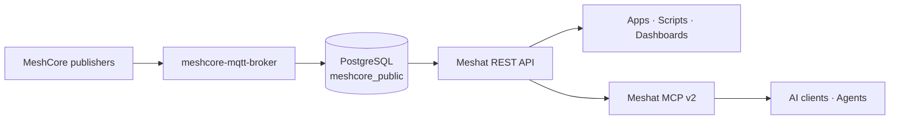

<p align="center">
  
</p>

<h1 align="center">Meshat API</h1>

<p align="center">
  <strong>Public MeshCore network data for developers, applications, and AI.</strong>
  <br>
  A read-only REST API and a native MCP v2 server — no account or API key required.
</p>

<p align="center">
  <a href="https://api.meshat.se"></a>
  <a href="https://api.meshat.se/docs"></a>
  <a href="#mcp-v2"></a>
</p>

<p align="center">
  
  
  
  
  <a href="LICENSE"></a>
</p>

<p align="center">
  <a href="#quick-start"><strong>Quick start</strong></a> ·
  <a href="#rest-api"><strong>REST API</strong></a> ·
  <a href="#mcp-v2"><strong>MCP v2</strong></a> ·
  <a href="#architecture"><strong>Architecture</strong></a> ·
  <a href="#development"><strong>Development</strong></a>
</p>

---

## Quick start

Choose the interface that fits what you are building:

| | REST API | MCP v2 |
| --- | --- | --- |
| **Best for** | Apps, scripts, dashboards, integrations | AI assistants, coding agents, agentic workflows |
| **Endpoint** | `https://api.meshat.se/v1` | `https://mcp.meshat.se/mcp` |
| **Transport** | HTTP + JSON | MCP over Streamable HTTP |
| **Authentication** | None | None |
| **Access** | Public · read-only | Public · read-only |
| **Discoverability** | [Swagger UI](https://api.meshat.se/docs) · [OpenAPI 3.1](https://api.meshat.se/openapi.json) | 23 discoverable domain tools |

### REST in one request

```bash
curl 'https://api.meshat.se/v1/meshcore/nodes?iata=JKG&role=repeater&limit=10&sort=last_seen&order=desc'
```

### MCP in one prompt

Paste this into an AI client or coding agent that can configure MCP servers:

```text
Install the Meshat.se MCP server for me. Name it `meshat` and use the remote
Streamable HTTP endpoint https://mcp.meshat.se/mcp with no authentication.
Use MCP protocol 2026-07-28, never legacy SSE, prefer user/global scope, and
verify the connection by listing its tools and calling `list_sources`.
```

> [!TIP]
> Once connected, you can stop thinking about tool names. Ask your AI things like **“Show the most recently seen MeshCore repeaters in JKG”** and let the client select the appropriate Meshat tool.

---

## REST API

**Base URL:** `https://api.meshat.se/v1`

The REST API exposes stable, domain-oriented MeshCore resources over HTTP/JSON. It is designed for direct use from scripts, services, dashboards, data pipelines, and generated OpenAPI clients.

### Common requests

**Discover available data sources**

```bash
curl 'https://api.meshat.se/v1/sources'
```

**Get the MeshCore overview**

```bash
curl 'https://api.meshat.se/v1/meshcore'
```

**Find recently seen repeaters in JKG**

```bash
curl -G 'https://api.meshat.se/v1/meshcore/nodes' \
  --data-urlencode 'iata=JKG' \
  --data-urlencode 'role=repeater' \
  --data-urlencode 'sort=last_seen' \
  --data-urlencode 'order=desc' \
  --data-urlencode 'limit=20'
```

**Find nodes within 50 km of a coordinate**

```bash
curl -G 'https://api.meshat.se/v1/meshcore/nodes' \
  --data-urlencode 'near_lat=57.7826' \
  --data-urlencode 'near_lon=14.1618' \
  --data-urlencode 'radius_km=50' \
  --data-urlencode 'limit=25'
```

**Search public messages**

```bash
curl -G 'https://api.meshat.se/v1/meshcore/messages' \
  --data-urlencode 'iata=JKG' \
  --data-urlencode 'order=desc' \
  --data-urlencode 'limit=20'
```

**Search the public Meshat.se documentation**

```bash
curl -G 'https://api.meshat.se/v1/docs/search' \
  --data-urlencode 'q=repeater' \
  --data-urlencode 'limit=10'
```

> [!NOTE]
> For every available query parameter, response schema, and example, use the interactive **[Swagger UI](https://api.meshat.se/docs)**. For code generation and tooling, use the **[OpenAPI 3.1 document](https://api.meshat.se/openapi.json)**.

### Pagination

Collection endpoints use bounded, stateless cursor pagination. A collection response has this shape:

```json
{
  "data": [],
  "pagination": {
    "limit": 20,
    "has_more": true,
    "next_cursor": "opaque-cursor"
  }
}
```

If `next_cursor` is present, pass it back as `cursor` with the **same filters and sort order**:

```bash
curl -G 'https://api.meshat.se/v1/meshcore/nodes' \
  --data-urlencode 'iata=JKG' \
  --data-urlencode 'sort=last_seen' \
  --data-urlencode 'order=desc' \
  --data-urlencode 'limit=20' \
  --data-urlencode 'cursor=opaque-cursor'
```

Cursors are opaque and query-bound. Store and return them unchanged; do not parse or construct them yourself.

### IATA vs. MeshCore region

> [!IMPORTANT]
> **IATA and MeshCore regions are different concepts.**
>
> - `iata` is a three-letter **geographic MQTT ingress area**, such as `JKG`.
> - `region` is a **logical MeshCore neighbor-reporting region**.
>
> Use the filter that matches the question you are asking. They are not interchangeable.

<details>
<summary><strong>REST endpoint reference</strong></summary>

<br>

| Area | Endpoints |
| --- | --- |
| **System** | `GET /`, `GET /healthz`, `GET /readyz`, `GET /openapi.json` |
| **Discovery** | `GET /v1/sources`, `GET /v1/meshcore` |
| **Documentation** | `GET /v1/docs`, `GET /v1/docs/search`, `GET /v1/docs/{path...}` |
| **Nodes** | `GET /v1/meshcore/nodes`, `GET /v1/meshcore/nodes/{public_key}`, `.../neighbors`, `.../adverts`, `.../sightings`, `.../telemetry` |
| **Observers** | `GET /v1/meshcore/observers`, `GET /v1/meshcore/observers/{public_key}`, `.../status`, `.../metrics` |
| **IATA** | `GET /v1/meshcore/iata`, `GET /v1/meshcore/iata/{code}` |
| **Regions** | `GET /v1/meshcore/regions`, `GET /v1/meshcore/regions/{region}`, `.../{region}/nodes` |
| **Packets** | `GET /v1/meshcore/packets`, `GET /v1/meshcore/packets/{sha256}`, `.../{sha256}/observations` |
| **Messages** | `GET /v1/meshcore/messages`, `GET /v1/meshcore/messages/{id}` |
| **Telemetry** | `GET /v1/meshcore/telemetry`, `GET /v1/meshcore/telemetry/{id}` |
| **Traces** | `GET /v1/meshcore/traces`, `GET /v1/meshcore/traces/{id}`, `.../{id}/hops` |
| **Statistics** | `GET /v1/meshcore/stats`, `GET /v1/meshcore/activity` |

</details>

### Errors and limits

Errors use a stable machine-readable envelope:

```json
{
  "error": {
    "code": "INVALID_CURSOR",
    "message": "...",
    "request_id": "..."
  }
}
```

Clients should handle `429 Too Many Requests`, use pagination instead of requesting unbounded result sets, and retain `request_id` when reporting an API problem. Public timestamps are ISO 8601 UTC.

---

## MCP v2

**Endpoint:** `https://mcp.meshat.se/mcp`

Meshat MCP v2 exposes the same public MeshCore domain to AI clients as **23 read-only tools**. The server uses MCP protocol revision **`2026-07-28`** over Streamable HTTP and has no PostgreSQL access; all domain data is read through the REST API.

### Recommended: let your AI install it

Copy and paste:

```text
Install the Meshat.se MCP server for me. Name it `meshat` and use the remote
Streamable HTTP endpoint https://mcp.meshat.se/mcp with no authentication.
Use MCP protocol 2026-07-28, never legacy SSE, prefer user/global scope, and
verify the connection by listing its tools and calling `list_sources`.
```

If your AI client can edit its own MCP configuration, this gives it everything it needs. If it cannot, use one of the manual configurations below.

<details>
<summary><strong>Claude Code</strong></summary>

<br>

Add Meshat for your user so it is available across projects:

```bash
claude mcp add --transport http meshat --scope user https://mcp.meshat.se/mcp
```

Or add it only to the current project:

```bash
claude mcp add --transport http meshat --scope project https://mcp.meshat.se/mcp
```

Then verify the server with Claude Code's MCP tooling and ask Claude to list the Meshat tools.

[Claude Code MCP documentation →](https://docs.anthropic.com/en/docs/claude-code/mcp)

</details>

<details>
<summary><strong>VS Code / GitHub Copilot</strong></summary>

<br>

Add this server to your user MCP configuration or `.vscode/mcp.json`:

```json
{
  "servers": {
    "meshat": {
      "type": "http",
      "url": "https://mcp.meshat.se/mcp"
    }
  }
}
```

In VS Code you can also run **MCP: Add Server** from the Command Palette and choose a remote HTTP server.

[VS Code MCP documentation →](https://code.visualstudio.com/docs/agent-customization/mcp-servers)

</details>

### What to ask your AI

After the server is connected, natural language is enough:

```text
Show the most recently seen MeshCore repeaters in IATA JKG.
```

```text
Find active MeshCore observers within 50 km of 57.7826, 14.1618.
```

```text
Summarize current MeshCore statistics and activity during the last 24 hours.
```

```text
Search the Meshat.se documentation for information about repeaters.
```

```text
Find the latest public messages seen through JKG and summarize the result.
```

<details>
<summary><strong>All 23 MCP tools</strong></summary>

<br>

| Area | Tools |
| --- | --- |
| **Discovery** | `list_sources`, `get_source`, `get_meshcore_overview` |
| **Nodes** | `search_nodes`, `get_node`, `get_node_neighbors` |
| **Observers** | `search_observers`, `get_observer` |
| **Regions** | `list_regions`, `get_region` |
| **IATA** | `list_iata`, `get_iata` |
| **Packets** | `search_packets`, `get_packet` |
| **Messages** | `search_messages`, `get_message` |
| **Telemetry** | `search_telemetry` |
| **Traces** | `search_traces` |
| **Statistics** | `get_meshcore_stats`, `get_meshcore_activity` |
| **Documentation** | `list_docs`, `search_docs`, `get_doc` |

Paginated MCP tools normalize REST collections to:

```json
{
  "items": [],
  "next_cursor": null
}
```

When `next_cursor` is present, pass it unchanged to the same tool together with the same query arguments.

</details>

<details>
<summary><strong>Programmatic MCP client example</strong></summary>

<br>

The repository pins `@modelcontextprotocol/client@2.0.0` for its MCP integration tests.

```bash
bun add @modelcontextprotocol/client@2.0.0
```

```ts
import {
  Client,
  StreamableHTTPClientTransport,
} from "@modelcontextprotocol/client";

const client = new Client(
  { name: "my-meshat-client", version: "1.0.0" },
  { versionNegotiation: { mode: { pin: "2026-07-28" } } },
);

const transport = new StreamableHTTPClientTransport(
  new URL("https://mcp.meshat.se/mcp"),
);

await client.connect(transport);

const { tools } = await client.listTools();
console.log(tools.map((tool) => tool.name));

const result = await client.callTool({
  name: "search_nodes",
  arguments: {
    iata: "JKG",
    role: "repeater",
    limit: 10,
  },
});

console.log(result.structuredContent);
await client.close();
```

</details>

> [!WARNING]
> Opening `https://mcp.meshat.se/mcp` directly in a browser sends a `GET` request and returns **405 Method Not Allowed**. This is expected. The MCP endpoint is designed for MCP clients using `POST`, not for browser navigation.

---

## Architecture



The service boundary is deliberate:

- [`Bjorkan/meshcore-mqtt-broker`](https://github.com/Bjorkan/meshcore-mqtt-broker) owns MQTT ingestion, database writes, the canonical `meshcore_public` schema, schema versioning, and migrations.
- `restful-api/` is the only service in this repository that reads PostgreSQL, using a read-only database role.
- `mcp-server-v2/` has no PostgreSQL client or credentials. Every MCP tool calls the REST API over HTTP.

---

## Development

### Requirements

- [Bun](https://bun.sh) **1.4.0** — pinned through `packageManager`
- Git
- Docker / Compose for PostgreSQL integration tests

This repository uses Bun as both runtime and package manager.

### Standard checks

```bash
# REST API
cd restful-api
bun install --frozen-lockfile
bun run check

# MCP v2
cd ../mcp-server-v2
bun install --frozen-lockfile
bun run check
```

`bun run check` covers formatting, linting, type checking, and tests.

<details>
<summary><strong>Full PostgreSQL integration tests</strong></summary>

<br>

The canonical database schema lives in the separate broker repository. Clone both repositories as siblings:

```bash
git clone git@github.com:Bjorkan/meshat-api.git
git clone git@github.com:Bjorkan/meshcore-mqtt-broker.git
```

Expected layout:

```text
workspace/
├── meshat-api/
└── meshcore-mqtt-broker/
```

Then run from `restful-api/`:

```bash
bun run test:integration
bun run check:full
```

The integration harness starts a disposable PostgreSQL instance, provisions the broker-owned schema, loads deterministic fixtures through the broker ingest path, and validates REST repository semantics against real PostgreSQL.

</details>

<details>
<summary><strong>Live read-only smoke tests</strong></summary>

<br>

REST API:

```bash
cd restful-api
API_BASE_URL=https://api.meshat.se bun run test:live
```

MCP v2:

```bash
cd mcp-server-v2
MCP_LIVE_BASE_URL=https://mcp.meshat.se bun run test:live
```

The MCP smoke test uses the official v2 client, verifies the 23-tool manifest, and performs representative read-only calls.

</details>

### Repository layout

```text
meshat-api/
├── restful-api/          # Public REST API, OpenAPI, read-only PostgreSQL access
├── mcp-server-v2/        # MCP v2 server; consumes REST only
├── API-CONTRACT.md       # Public HTTP naming and resource semantics
├── CONTRIBUTING.md       # Contribution and deployment rules
└── compose.yaml          # Production-oriented service composition
```

For schema ownership and cross-repository compatibility rules, see [CONTRIBUTING.md](CONTRIBUTING.md).

---

## Troubleshooting

| Symptom | What it means |
| --- | --- |
| `405 Method Not Allowed` when opening the MCP URL | Expected. `/mcp` is a `POST` endpoint for MCP clients. |
| MCP client tries `/sse` | Configure the exact HTTP endpoint `https://mcp.meshat.se/mcp`; legacy SSE is not supported. |
| MCP client fails protocol negotiation | The server requires MCP `2026-07-28`. Upgrade to a client that supports the current protocol revision. |
| REST rejects a cursor | Reuse the cursor unchanged with the same filters, sort, and order that created it. |
| REST returns `429` | The public service is rate-limited. Reduce polling frequency and retry later. |
| Geographic filter is rejected | Supply `near_lat`, `near_lon`, and `radius_km` together. |
| Unsure which REST parameters are valid | Check the endpoint in [Swagger UI](https://api.meshat.se/docs). |

---

## Contributing

Contributions are welcome. Read [CONTRIBUTING.md](CONTRIBUTING.md) before changing public contracts, database-related behavior, or cross-repository integration semantics.

## License

[MIT](LICENSE) © 2026 Bjorkan

<p align="center">
  <sub>Built for the Swedish MeshCore community at <a href="https://meshat.se">Meshat.se</a>.</sub>
</p>
